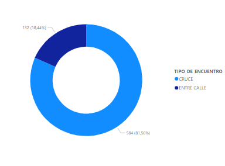

# **Siniestros Viales**

<!--  -->
*      

* 
<!-- -->

Este es un proyecto centrado en el análisis de los accidentes ocurridos en la Ciudad Autónoma de Buenos Aires entre el 2016 y el 2021,en este espacio vamos a analizar las diferentes tendencias y patrones que se encontraron explorando los datos.

**Vehículos más afectados**

La mayor parte de las víctimas son motociclistas y peatones, la moto tiene una gran fama de ser un vehículo que sufre muchos accidentes sobretodo si se maneja imprudentemente. Sin embargo no se puede concluir que sea más peligroso que un auto, ya que la moto es más económica y suele ser la preferencia de muchos más usuarios; lo que si podemos hacer es proponer una solución para evitar más accidentes.

Aquí se observa la distribución de las víctimas en moto por franja horaria, en su mayoría los accidente ocurren en la mañana al haber mucho más movimiento; pero podemos notar que en la noche ocurre la tercera parte de los accidentes que ocurren en la mañana. Esto se puede disminuir si se aplica una ley de chalecos refractarios más dura ; el chaleco refractario debería ser de uso obligatorio para el conductor para ser visto por los demás vehículos, esta es una medida efectiva que puede disminuir significativamente los siniestros viales para este sector.

**Vehículos más acusados**

Los principales acusados de los accidentes son los autos, los pasajeros y los vehículos de cargas pesadas. Esto es previsible al ser vehículos masivos, con respecto a los pasajeros puede deberse a imprudencias; se debe garantizar que estos vehículos respeten el paso de los peatones. También se puede deber a que los motociclistas suelen realizar maniobras imprudente como pasarse entre dos vehiculos de cargas pesadas, es importante inculcar una cultura de seguridad vial.

**Tipo de encuentro**

Los accidentes ocurren más en las esquinas que en medio de las calles, esto era algo que se esperaba. Explorando un poco más la información se determinó que en verano ocurren la mayor parte los accidentes en cruces, esto se puede deber a cortes de luz que afectan las señalizaciones; de noche se puede observar en las calles semáforos con señales confusas, esto sumado a que en este horario puede haber personas bajo el efecto del alcohol conduciendo. Lo que se debe hacer es garantizar el correcto funcionamiento de los semáforos en las esquinas.

**Víctimas por género**

Observando el gráfico podemos concluir que la mayor parte de las víctimas son hombres, esto se puede deber a una mayor imprudencia al conducir o simplemente que haya más conductores hombres; sin embargo los datos por si mismos no pueden llegar a esta conclusión ya que tendríamos que averiguar cuantos vehículos son propiedad de cada género. Lo que si podemos estudiar es qué vehículo influye más en este sesgo de género; se llegó a la conclusión de que la moto además de ser el vehículo que más muertes causa, también es el que más separa a los hombres de las mujeres en cuanto víctimas, esto debido a que es un medio de transporte más utilizado por hombres, además de que las mujeres suelen ser más prudentes al conducir.

**Barrios afectados**

En el gráfico se observan los barrios más afectados por los accidentes mortales en las vías, Flores y Palermo se llevan la mayor parte de las víctimas. Sin embargo esta información no es concluyente, ya que dependiendo de la franja horaria los barrios cambian; el único patrón que se conserva es el de Flores ocupando los primeros lugares. Flores posee zonas de tránsito masivo como la zona de la calle de Avellaneda donde hay un comercio masivo de ropa y calzado, siendo una zona de distribución para los comerciantes de la provincia, por Flores pasan varias calles principales como Avenida Rivadavia y Avenida Directorio, además de poseer calles estrechas en algunos sectores.

**¿Qué mejorar?**

1.- Recopilar más datos para llegar a conclusiones más acertadas, por ejemplo averiguar el género de las personas que son propietarias de cada tipo de vehículo. Así podriamos estudiar realmente si los accidentes ocurren más frecuentemente en los hombres por imprudencia o porque simplemente la mayoria de vehiculos son propiedad de ellos.

2.- Estudiar mejor las leyes de tránsito del pais para saber qué se puede modificar en la ley de tal forma que disminuyan los siniestros viales.

3.- Comparar el desempeño de Buenos Aires con otras capitales del Mundo

## Herramientas

- Python
- Pandas
- Power BI
- Git

## Recursos

- [Dataset Lesiones](https://data.buenosaires.gob.ar/dataset/victimas-siniestros-viales)
- [Dataset Homicidios](https://data.buenosaires.gob.ar/dataset/victimas-siniestros-viales)
  

### informacion complementaria

-[Investigaciones de seguridad vial Buenos Aires](https://buenosaires.gob.ar/jefaturadegabinete/movilidad/investigaciones-de-seguridad-vial)

-[Estudios Observatorio vial nacional](https://www.argentina.gob.ar/seguridadvial/observatoriovialnacional/estudios)

## contacto

<a href="https://github.com/Fsando1993">mi perfil de github</a>
 
<a href="https://www.linkedin.com/in/ana-florencia-sandoval-876615286/">mi perfil de linkedin</a>
